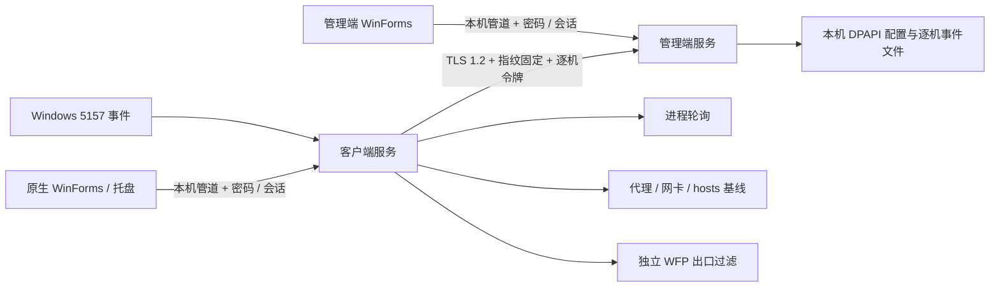

# 架构与维护

## 组件和边界

同一安装包通过初始化选择客户端或管理端。`Ycsz.exe --service` 为 Windows SCM 托管的 LocalSystem 服务；默认启动为密码管理窗口，`--tray` 为客户端托盘。GUI 进程退出不终止服务。

客户端与管理端不能在同一 Windows 实例同时安装：本版使用一个服务名称 `YcszFirewall`、一个本地管道和一个配置根。验证时使用两台隔离 Windows VM。

## 数据与权限

`C:\ProgramData\YcszFirewall` 由 SYSTEM 与本机 Administrators 访问，禁止继承上层 Users 权限。配置先写临时文件，Flush 后原子替换。

| 文件 | 内容 |
| --- | --- |
| settings.bin | 角色、PBKDF2 密码记录、逐机令牌/管理端证书口令、原审计位，DPAPI 保护 |
| client.bin | 客户端最新策略、基线、待上报队列、近期事件、退出标记，DPAPI 保护 |
| installation-baseline.bin | 初装网络/hosts 原始基线，DPAPI 保护 |
| manager.bin | 管理端白名单、注册索引与逐机策略，DPAPI 保护 |
| node-ID.bin | 管理端逐机状态和近期事件，DPAPI 保护；避免每次心跳重写全库 |
| manager.pfx | 安装现场生成的 RSA 3072 证书；随机口令加密私钥；目录 ACL 限制 |
| service.log / service.previous.log | 不含密码/令牌的事件与错误；约 2 MiB 轮转 |

密码使用随机 32 字节盐、PBKDF2-HMAC-SHA1 210,000 次、32 字节结果。SHA1 用作 PBKDF2 PRF 是 .NET 4.5 内置兼容方案，不使用裸 SHA1 存储密码。密码最少 12 字符、最多 256 字符。

注册包是版本化 AES-256-CBC + HMAC-SHA256 的 encrypt-then-MAC 格式；使用独立随机 IV，先验证 HMAC 再解密。每包随机盐，派生 64 字节并拆分为加密与认证密钥。没有预置通用密码、共享私钥或全机通用令牌。

本机管道拒绝 Network SID；客户端在发送凭据前，通过 `GetNamedPipeServerProcessId` 与 SCM 记录的服务 PID 比对，防止服务停机时管道名称被占用后盗取密码。会话在 15 分钟后过期；关闭管理窗口注销会话。

## 调度与恢复

- 进程扫描：独立线程约每秒检查一次；轮询不能保证捕获极短生命周期进程。
- 代理检查：计划间隔 5 秒；网络检查计划间隔 15 秒，共享系统操作线程，实际间隔受系统调用耗时影响。
- 心跳：一次请求完成后约 10 秒再发；离线继续最近策略。
- 规则刷新：策略变化或约 5 分钟；单域 DNS 超时 5 秒，总解析预算约 30 秒；失败保持原规则并上报。
- WFP provider/sublayer/filter 持久化，服务退出后不会自动释放限制。首次服务启动先应用最小限制，再应用完整策略。
- 服务退出标记先写“不正常”，正常停止后改为“正常”；SCM 配置 5/10/30 秒重启，恢复启动上报异常退出。
- 不保证 Windows 启动最早阶段、BFE 未启动前或既存连接的完全隔离；这些需要 Windows VM 验证与更深入的启动层规则。

## 网络规则

WFP 在 IPv4/IPv6 的 ALE_AUTH_CONNECT 层建立自己的子层，允许规则高于本产品默认阻断规则。以事务替换本产品过滤器，失败中止事务；不重置 Windows 防火墙全局配置。

白名单地址仅放行 TCP 80/443。必要例外：IPv4/IPv6 回环、系统宿主及本程序向当前 DNS 服务器的 TCP/UDP 53、系统宿主 DHCP、仅本程序到固定管理端 IP 的 TCP 17443。QUIC/UDP 443 不放行，浏览器需要回落到 TCP。其他本机防火墙产品/域策略可能进一步限制连接。

域名在客户端解析后按地址放行，没有 HTTPS 主机身份验证。共享 IP、DNS 污染、白名单站点自身提供转发服务属于明确的剩余风险；这不是严格域名防火墙。域名记录变化在刷新周期后生效，不是按 DNS TTL 实时更新。

hosts 快照同时记录文件存在性，删除后可重建；初装不存在的文件按不存在恢复。回滚仅写变化的 DHCP/DNS 值，避免 hosts-only 漂移重复写网卡配置。

网络基线涵盖 IPv4 DHCP、IPv6 DHCP/路由发现、各自 DNS、手工 IP、静态下一跳路由、网卡启用状态与协议绑定、hosts。DHCP 租约与自动 IPv6 地址不作为漂移。当前不覆盖全部网卡高级驱动参数、无线 SSID 配置、NIC teaming、第三方隧道内部配置及任意全局路由来源；不得将“网络基线”表述为系统网络所有参数的完整快照。

远程网络命令先持久化已尝试版本，同一版本不因失败/重启反复自动执行；管理员重新保存下发新版本才会重试。远程网络变更在应用后复查配置，并验证管理端连接再更新基线；失败尝试回到旧基线。回滚本身失败仍需现场管理员恢复。新增 IP 网卡被禁用，缺失驱动只告警，避免假装可以重建硬件。

## 容量

最多 64 个注册客户端、512 条白名单、4096 个解析地址；单帧 1 MiB；网络快照最多 300KB；客户端待上报队列 2000 条、近期记录 200 条；管理端每机近期事件 200 条。队列满时丢弃最旧事件并累计丢弃计数，上报状态包含该计数。完整合规审计应接入独立存储，当前滚动记录不等于不可丢失的永久日志。

管理端 TLS 并发上限 16、连接寿命约 15 秒、读写超时 10 秒。本机管道串行处理，单连接约 15 秒上限。局域网拒绝服务和本机恶意进程持续占用管道仍需机房网络/账户策略配合。

## 官方接口依据

- [FWPM_FILTER0](https://learn.microsoft.com/en-us/windows/win32/api/fwpmtypes/ns-fwpmtypes-fwpm_filter0)
- [WFP ALE 层](https://learn.microsoft.com/en-us/windows/win32/fwp/ale-layers)
- [Microsoft Windows SDK 元数据头文件](https://github.com/microsoft/win32metadata/tree/main/generation/WinSDK/RecompiledIdlHeaders)

WFP x64 结构体以显式偏移实现，并对关键尺寸和偏移做测试；仍需在真实 Windows 中验证 `FwpmFilterAdd0`、审计和规则优先级。
